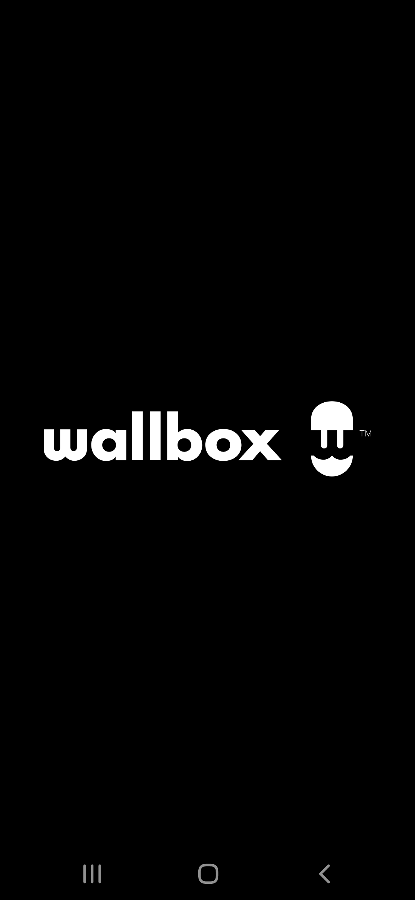
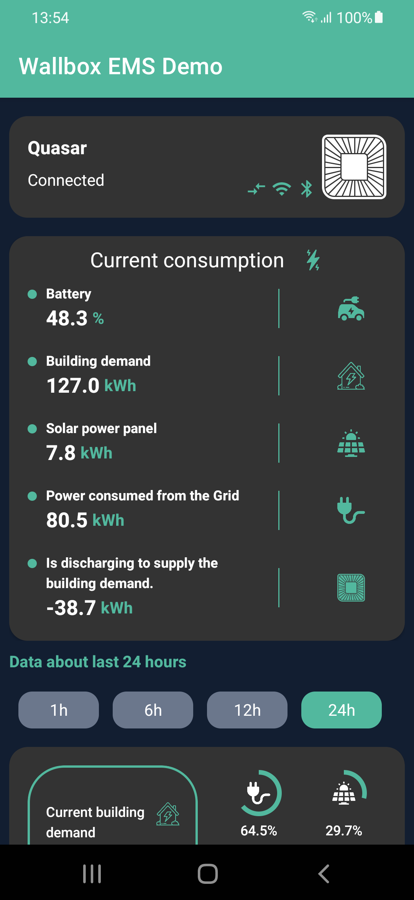

# Wallbox EMS Demo

I have made it with much love ❤️. Below, I have created a list of things to improve, since due to lack of time I have not been able to.

#### Introduction
The app, contains the nexts screens:

| Screenshot  | Description  |
|:----------|:----------|
|  | Splash screen with the main logo. Contains a static countdown to access the Dashboard screen|
|   | Dasboard screen. This main screen, contains all widgets.|
|  | Temporally view in dashboard screen while the data is loaded.
|  | Chart screen. Contain the chart with all historic data with filters by time.

#### Used technologies
In this project, i used the next dependencies:
- [Dagger-Hilt](https://dagger.dev/hilt/) - To inject dependencies.
- [Shimmer](http://facebook.github.io/shimmer-android/) - Is used to create placeholder view in dashboard screen.
- [MPAndroidChart](https://github.com/PhilJay/MPAndroidChart) - Chart
- [Retrofit](https://square.github.io/retrofit/) + [OkHttp](https://square.github.io/okhttp/) - For the next improvement of getting the json from the internet, I will use this library 🥰.

#### Explanation
I used a MVVM architecture. each screen contains its ViewModel class to store the data obtained from the UseCases and manage the functions to control the data. I used a MutableLiveData class type to store the objects and to listen for changes to them.

### Pending improvements
- Create axis y in to the chart to show date
- Improve stuck at open Dashboard screen.
- More testing
- Get the json data from the network and not from the local file
- Migrate to Jetpack Compose