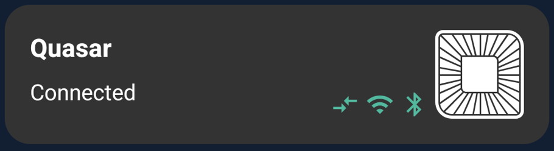
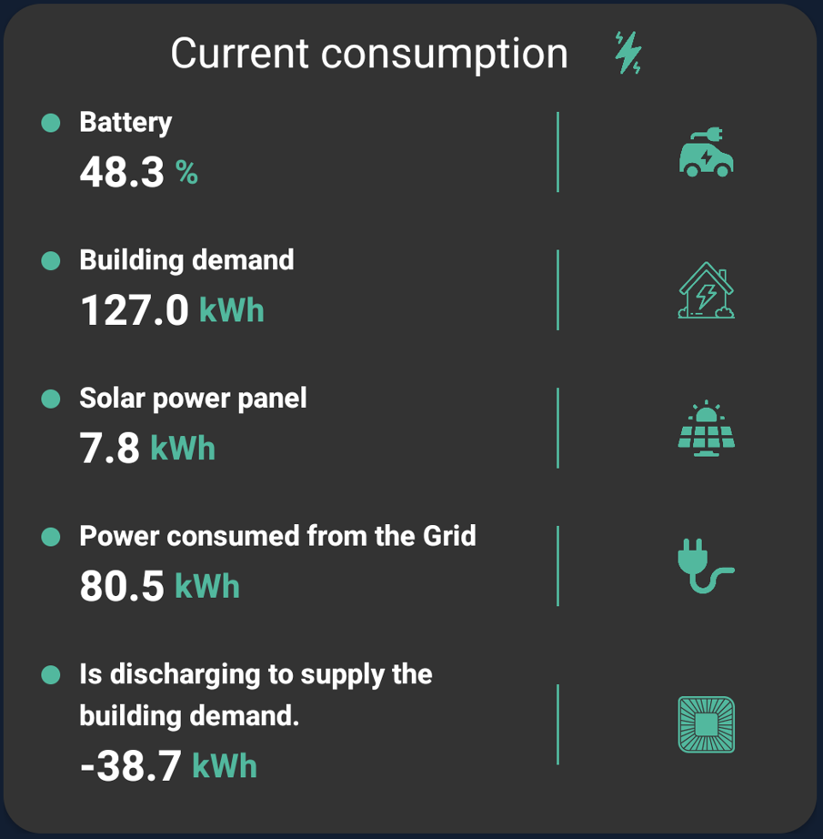

# Wallbox EMS Demo

I have made it with much love ❤️. Below, I have created a list of things to improve, since due to lack of time I have not been able to.

### Introduction
The app, contains the nexts screens:

| Screenshot  | Description  |
|:----------|:----------|
|  | Splash screen with the main logo. Contains a static countdown to access the Dashboard screen|
|   | Dasboard screen. This main screen, contains all widgets.|
|  | Temporally view in dashboard screen while the data is loaded.
|  | Chart screen. Contain the chart with all historic data with filters by time.

### Used technologies
In this project, i used the next dependencies:
- [Dagger-Hilt](https://dagger.dev/hilt/) - To inject dependencies.
- [Shimmer](http://facebook.github.io/shimmer-android/) - Is used to create placeholder view in dashboard screen.
- [MPAndroidChart](https://github.com/PhilJay/MPAndroidChart) - Chart.
- [Retrofit](https://square.github.io/retrofit/) + [OkHttp](https://square.github.io/okhttp/) - For the next improvement of getting the json from the internet, i will use this library 🥰.

### Explanation
I implemented a MVVM architecture. Each screen contains its ViewModel class to store the data obtained from the UseCases and manage the functions to control the data. I used a MutableLiveData class type to store the objects and to listen for changes to them. 

I have created some UseCases classes, which allow operations such as obtaining the json from the local file, obtaining summaries of historical data, etc...

### Widgets

- Widget with charger info. This widget is complementary, only offer info about the charger connected (fake).

 
 

- Live data widget. I used the live data json to fill this widget, and i show the data of the sources in it, with the values in kWh. The vehicle battery percentage is displayed in percentage.

 
 

- Statistics data widget. In this widget, the values are displayed as percentages of the data history by date filter.
Implementing these date filters has been a decision to not handle a large amount of data and to be able to visualize the information better in a short period of time.
To obtain the percentages, first i obtain the items into date range, next i calculate the average consumption of the building, and to finish, i calculate the percentage of each source with the previous average.

 
 

- Amount of energy discharged/charged widget. First i obtain the items into date range and if the value 'quasars_active_power' is negative or positive, it means that the car is charging, or it is providing power to the building.
Finally, the average of that field is calculated, and multiplied by the number of hours selected in the filter.

### Pending improvements
- Create axis y in to the chart to show date.
- Improve stuck at open Dashboard screen.
- More testing.
- Get the json data from the network and not from the local file.
- Migrate to Jetpack Compose.